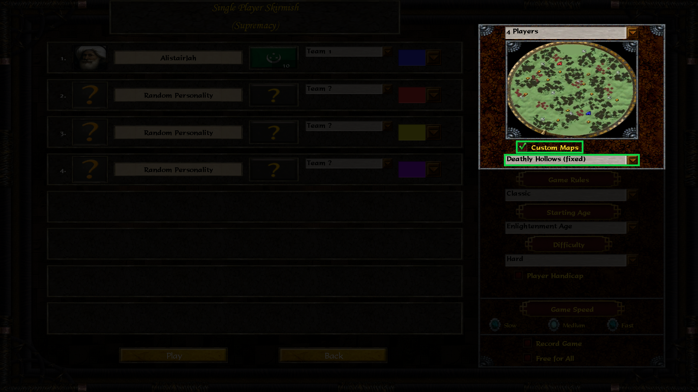

<p align="center">
  
</p>

# Deathly Hollows Dullahan Script

## Description

This repository contains a partial fix for the Deathly Hollows map in
[Wars of Liberty](https://aoe3wol.com/), an Age of Empires III mod.

Deathly Hollows is a map where a powerful horseman, the Dullahan, comes at
players' bases to attack them. The Dullahan would pick a random unit from the
player who has the least population and attack it. The map is currently broken
in the original mod, as the Dullahan won't appear at all. The files in this
repository partially fix the issue (the multiplayer mode is not supported).

## How to install

1. [Go to the releases page](https://github.com/thinotmandresy/wol-deathly-hollows/releases)
   and download the latest release.
2. Extract the archive in `%USERPROFILE%\Documents\My Games\Wars of Liberty`.
   Basically, you should have the following folder structure:

```text
├── 📁 (Your name)
│   ├──📁  Documents
│   │   ├── 📁 My Games
│   │   │   ├── 📁 Wars of Liberty
│   │   │   │   ├── 📁 RM3
│   │   │   │   │   ├── 📄 hollows2.xml
│   │   │   │   │   ├── 📄 hollows2.xs
│   │   │   │   ├── 📁 Trigger3
│   │   │   │   │   ├── 📄 dhollows.xs
```

And that's it! You can now play the map in single player mode.

## How to play

At the pre-game menu, check "Custom Maps" and select "Deathly Hollows (fixed)"
in the list. Then, you can start the game as usual.



## How to contribute

There is not much to do with this map since it was not meant to have complex
gameplay. However, if you find a bug or want to improve the map, please ping
me on [WoL's Discord server](https://discord.gg/3gJ2VZ6) (@alistairjah).

## Credits

- The [Wars of Liberty Team](https://aoe3wol.com/team) for making this mod.
- musketeer925 for the original trigger script.
